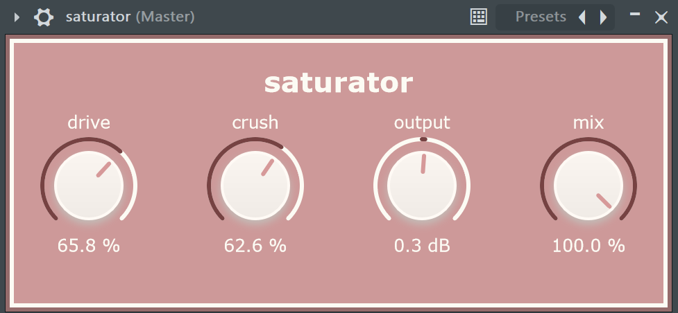

# saturator

### a soft saturation plugin for music production

## features
- drive parameter for subtle distortion and overall warmth
- crush parameter for sample rate reduction and harmonic excitement
- output gain and mix parameters to shape the overall sound
- intuitive design layout

### building the VST3 file:

* [ ] [Download JUCE](https://juce.com/download/) if you don't already have it.

* [ ] `git clone` this repo and open the .jucer file with Projucer.

* [ ] Under the exporters tab, create an export target for your system/IDE.

* [ ] Open the exported project in your IDE and build a release version.
> [!NOTE]
> If you're building a Debug version, you may need to disable "copy plugin step" under debug settings. This can cause issues if the IDE does not have permission to write to the VST3 Binary Location.

* [ ] The VST3 file should now be available to use under Builds > (your IDE) > ... > Release

## credits

- DSP layout - [Matthijs Hollemans](https://github.com/hollance/mda-plugins-juce/tree/master)
